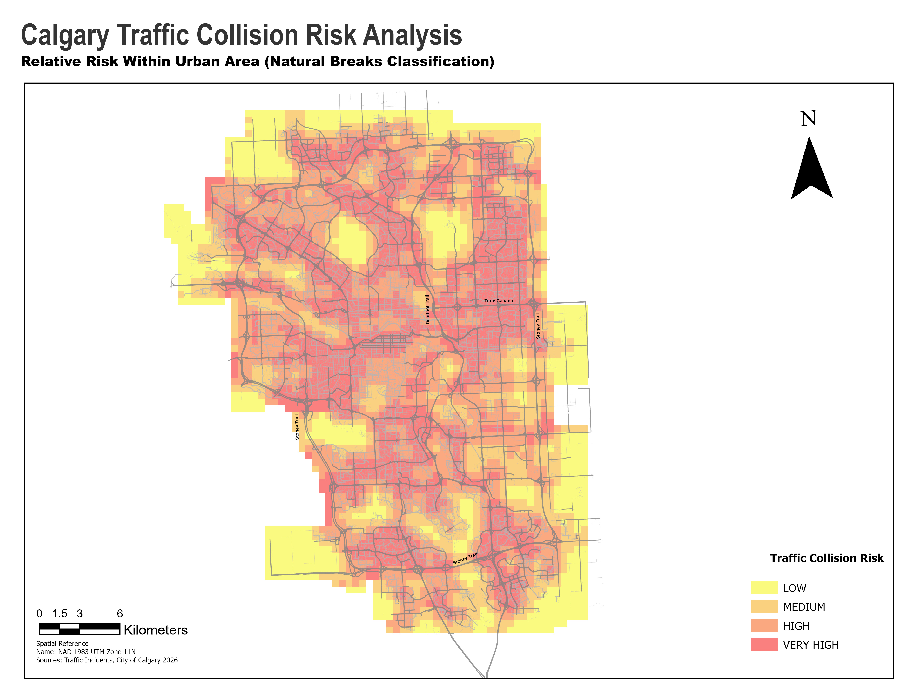
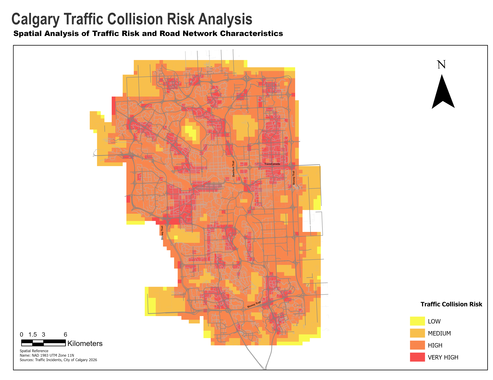

# Calgary Traffic Collision Risk Prediction

Predicting high-risk zones for traffic collisions in Calgary using open civic
data, road network analysis, and machine learning.


*Predicted collision risk by zone (relative scale within the urban area — see "Risk map" section below for the full comparison with the absolute-scale version).*

## Overview

This project identifies which areas of Calgary are statistically more likely
to experience high-risk traffic incidents, using ~10 years of open incident
data (2016–present) combined with road network characteristics. It combines
GIS spatial analysis (grid construction, road network feature engineering,
spatial smoothing) with a machine learning classification model.

**Why this project:** most public "collision prediction" projects for Calgary
stop at a simple map of raw incident points. This one goes further by (1)
engineering genuinely independent predictors from the road network instead of
reusing incident-derived fields, (2) explicitly checking for and removing
data leakage, and (3) comparing raw incident volume against a road-exposure-
normalized rate — which turn out to disagree on 30% of zones, a finding with
real implications for how a city would prioritize interventions.

## Data sources

| Dataset | Source | Description |
|---|---|---|
| Traffic Incidents | [data.calgary.ca](https://data.calgary.ca) | ~64,600 traffic incident records, Dec 2016–present, with location and free-text description |
| Street Centreline | [data.calgary.ca](https://data.calgary.ca) | ~120,000 road segments with functional classification (arterial, collector, residential, etc.) |

## Methodology

1. **Text categorization** — the incident `DESCRIPTION` field is unstructured
   free text (dispatcher notes), not a clean incident-type label. A keyword-
   based rule set classifies each record into categories (multi-vehicle
   collision, single-vehicle collision, pedestrian, cyclist, stalled vehicle,
   signal malfunction, etc.), reaching 99% classification coverage.
2. **Spatial grid** — Calgary is divided into a 500m x 500m fishnet grid.
   Each of the ~64,600 incidents is spatially joined to its cell, and each
   cell is labeled with a risk level (quartiles of incident count).
3. **Road network features** — using the Street Centreline dataset, each
   grid cell gets independent, incident-agnostic features: total road
   length, % arterial road, number of road segments, and road density.
   These are the only features used to train the model — fields derived
   from the incidents themselves (e.g. % of incidents blocking a lane) are
   deliberately excluded as predictors to avoid data leakage.
4. **Two risk definitions** — a raw risk level (incident count by quartile)
   and a normalized risk level (incidents per km of road, for cells with at
   least 200m of road). The two agree on only 69.7% of cells, suggesting
   that "where incidents happen most" and "where the road is
   proportionally more dangerous" are meaningfully different questions.
5. **Model** — a Random Forest classifier predicts whether a cell is
   high-risk, using only road network features and geometric quadrant.
   Class imbalance (22% positive) is handled with balanced class weights.
6. **Spatial smoothing** — the raw per-cell predictions are noisy street-to-
   street ("salt and pepper" pattern). A Focal Statistics mean filter
   (ArcGIS Pro, 3x3 neighborhood over the rasterized probability surface)
   smooths this into continuous risk corridors that align with real
   arterial roads.

## Risk map

Two versions of the final risk map are included, using the same underlying
model predictions but different color classification scales — each answers
a slightly different question.

| Absolute scale (fixed quartile breaks, full city extent) | Relative scale (Natural Breaks, urban area only) |
|---|---|
|  |  |
| *"How risky is this urban cell compared to the entire city, rural periphery included?"* | *"How does this cell compare to other urban cells specifically?"* |

**Why both:** classifying the same continuous probability surface with
Natural Breaks recalculated only on the cropped urban area shifts the color
thresholds, since it drops the many near-zero rural cells that anchor the
low end of the full-city distribution. Neither version is "more correct" —
they answer different questions. The absolute-scale map shows that the
built-up area of Calgary is, as a whole, already above the full-city risk
average (it is dominated by HIGH/VERY HIGH). The relative-scale map
recovers visual contrast *within* the urban area, useful for prioritizing
between urban zones rather than comparing urban vs. rural. This mirrors the
same raw-vs-normalized-risk distinction discussed above — the classification
scale you choose changes the story the map tells, and being explicit about
which one you're using (and why) matters more than picking "the right one."

The predicted high-risk zones (red clusters) align visually with known major
corridors (Deerfoot Trail, Crowchild Trail, Glenmore Trail) and complex
intersections, while the lowest-risk pockets correspond to Calgary's largest
parks (Nose Hill Park, Fish Creek Provincial Park), which have minimal
internal road network — a reassuring qualitative check that the model is
picking up genuine spatial patterns rather than noise.

## Results

| Metric | Logistic Regression | Random Forest |
|---|---|---|
| AUC-ROC | 0.922 | **0.935** |
| Recall (high risk) | 0.89 | 0.93 |
| Precision (high risk) | 0.54 | 0.56 |

**Feature importance (Random Forest):**

| Feature | Importance |
|---|---|
| % arterial road | 0.306 |
| Total road length | 0.298 |
| Road density | 0.220 |
| Number of road segments | 0.161 |
| Quadrant (geometric) | < 0.02 combined |

The model was deliberately tuned to favor **recall over precision**: in a
road safety context, the cost of missing a genuinely dangerous zone (a false
negative) is higher than the cost of flagging a zone that turns out to be
lower-risk (a false positive).

## Key finding: raw volume vs. exposure-normalized risk

30% of grid cells change risk category depending on whether risk is measured
as raw incident count or as incidents per km of road. This suggests that
"where incidents happen most" (useful for emergency response planning) and
"where the road is proportionally more dangerous" (useful for infrastructure
redesign) are different questions that may call for different interventions.

## Limitations

- The incident dataset has no official severity field (no injury/fatality
  classification); "lane blocked" is used as an informal severity proxy but
  is not equivalent to a police-reported severity code.
- Predictors do not include traffic volume (AADT), which would likely
  improve the model but is not available in this open dataset.
- The 500m grid is a modeling choice; results are sensitive to cell size,
  and this was not formally optimized.

## Tech stack

Python (pandas, geopandas, scikit-learn, folium), ArcGIS Pro (spatial
statistics, cartography, Focal Statistics), QGIS.

## Reproducing this project

Scripts are numbered and meant to be run in order:

```
scripts/01_categorize.py            # text categorization of incidents
scripts/02_build_grid.py            # spatial grid + risk labeling
scripts/03_road_network_features.py # road network feature engineering
scripts/04_train_model.py           # model training and evaluation
scripts/05_generate_risk_map.py     # predictions + interactive map
```

Requires: `pandas`, `geopandas`, `scikit-learn`, `joblib`, `folium`.
Raw data (not included in this repo — download separately from
data.calgary.ca) goes in `data/raw/`; all processed outputs are written to
`data/processed/`.

## Skills demonstrated

This project was built to showcase the intersection of geomatics/GIS
engineering and applied data science:

| Skill area | Where it shows up in this project |
|---|---|
| Geospatial engineering (topographic engineering background) | Coordinate system selection and reprojection (WGS84 ↔ UTM Zone 11N), spatial grid construction, road network geoprocessing |
| GIS software (ArcGIS Pro / QGIS) | Polygon-to-raster conversion, Focal Statistics spatial smoothing, Extract by Mask, cartographic layout design |
| Data science / ML (TripleTen certification) | Text categorization via rule-based NLP, feature engineering, data leakage detection and correction, model selection (Logistic Regression vs. Random Forest), evaluation beyond accuracy (precision/recall/AUC-ROC for imbalanced classes) |
| Applied statistics | Bias-variance tradeoff considerations in hyperparameter tuning, quartile-based classification, exposure normalization (incidents per km of road) |

## Author

Alex Garcia — Topographic/Geomatics Engineer, MSc in Geographic Information
Systems, 9-month project-based Data Science certification (TripleTen).
Currently based in Calgary, AB, building applied data science skills on top
of a geospatial engineering background.
[LinkedIn](https://www.linkedin.com/in/afgarciar/)
